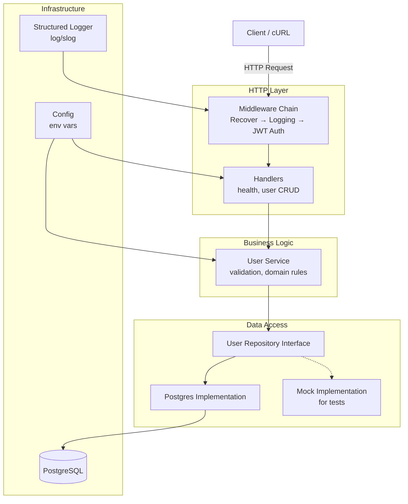
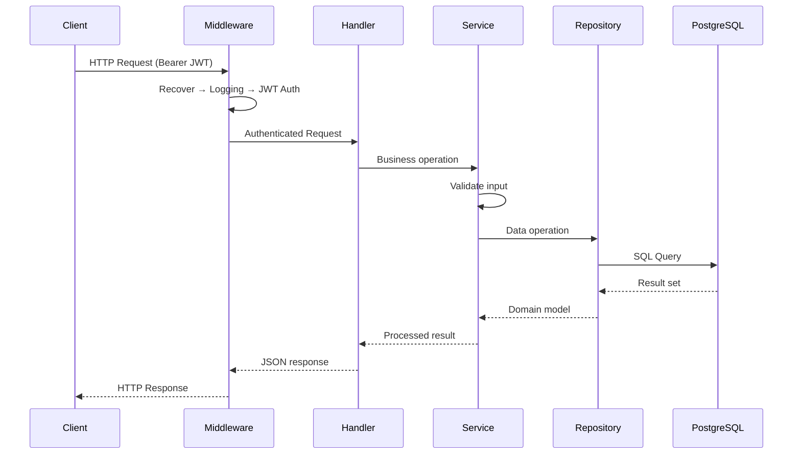

# Go Production REST API Starter

A production-grade Go REST API showcasing clean architecture, JWT authentication, structured logging, graceful shutdown, and full DevOps tooling. Designed as a portfolio reference for senior-level Go engineering.


---

## Architecture



### Request Flow



---

## Design Decisions

### Clean Architecture (Layered)
- **Handler → Service → Repository**: Each layer has a single responsibility. Handlers parse HTTP, services enforce business rules, repositories handle persistence.
- **Interface-based repositories**: The service depends on `UserRepository` interface, not the Postgres implementation. This enables unit testing with mocks without a database.

### Standard Library First
- **`net/http` with Go 1.22+ routing**: Uses the new `http.ServeMux` with method-based patterns (`GET /users/{id}`). No third-party router needed.
- **`log/slog`**: Go's structured logging standard introduced in 1.21. No external logging dependency.
- **`database/sql`**: Direct driver usage without an ORM. SQL is explicit and auditable.

### Graceful Shutdown
- Listens for `SIGINT`/`SIGTERM`, then gives in-flight requests 30 seconds to complete before forcing exit.
- Database connections are deferred-closed.

### JWT Authentication
- Bearer token validation using `golang-jwt/jwt/v5`.
- User identity (ID, email) injected into request context.
- Public health endpoint excluded from auth; all `/users` routes require a valid token.

### Testing Strategy
- **Table-driven tests**: Every test uses the `tests := []struct{...}` pattern for clarity and extensibility.
- **Hand-written mocks**: The mock repository records all calls and returns configurable responses — no code generation dependency required.
- **`httptest`**: Handler tests use `httptest.NewRequest` and `httptest.NewRecorder` for fast, isolated HTTP testing.
- **Race detection**: CI runs `go test -race`.

### Configuration
- All config sourced from environment variables with sensible development defaults.
- Production validation: refuses to start if `JWT_SECRET` or `DB_PASSWORD` are still default values.

---

## Project Structure

```
.
├── cmd/api/main.go              # Entry point, graceful shutdown, DI wiring
├── internal/
│   ├── config/config.go         # Env-based config with validation
│   ├── handler/
│   │   ├── handler.go           # HTTP handlers (health, user CRUD)
│   │   └── response.go          # Standard JSON response helpers
│   ├── middleware/
│   │   ├── auth.go              # JWT Bearer token validation
│   │   ├── logging.go           # Structured request logging (slog)
│   │   └── recover.go           # Panic recovery
│   ├── model/user.go            # User domain model + input validation
│   ├── repository/
│   │   ├── user_repo.go         # Interface + Postgres implementation
│   │   └── mock/mock_user_repo.go  # Hand-written mock for testing
│   ├── service/user_service.go  # Business logic layer
│   └── server/server.go         # HTTP server, routing, middleware chain
├── migrations/                  # SQL migration files
├── api/openapi.yaml             # OpenAPI 3.0 specification
├── test/                        # Integration & unit tests
├── deploy/
│   ├── Dockerfile               # Multi-stage build (alpine)
│   ├── k8s/                     # Kubernetes manifests
│   └── terraform/               # AWS ECS Fargate IaC
├── .github/workflows/ci.yml     # GitHub Actions CI/CD
├── Makefile                     # build, test, lint, docker-build
└── README.md
```

---

## API Endpoints

| Method | Path            | Auth | Description          |
|--------|-----------------|------|----------------------|
| GET    | `/health`       | No   | Health check         |
| POST   | `/users`        | Yes  | Create a user        |
| GET    | `/users`        | Yes  | List users (paged)   |
| GET    | `/users/:id`    | Yes  | Get a user by ID     |
| PUT    | `/users/:id`    | Yes  | Update a user        |
| DELETE | `/users/:id`    | Yes  | Delete a user        |

### Example Requests

```bash
# Health check
curl http://localhost:8080/health

# Create a user (replace <TOKEN> with a valid JWT)
curl -X POST http://localhost:8080/users \
  -H "Authorization: Bearer <TOKEN>" \
  -H "Content-Type: application/json" \
  -d '{"email":"user@example.com","name":"John Doe"}'

# List users
curl http://localhost:8080/users?page=1&page_size=10 \
  -H "Authorization: Bearer <TOKEN>"

# Get user by ID
curl http://localhost:8080/users/550e8400-e29b-41d4-a716-446655440000 \
  -H "Authorization: Bearer <TOKEN>"
```

---

## Running Locally

### Prerequisites
- Go 1.22+
- PostgreSQL 14+ (or use Docker)
- `make` (optional but recommended)

### Option 1: Direct Go run

```bash
# 1. Start PostgreSQL
docker run -d --name postgres -p 5432:5432 \
  -e POSTGRES_PASSWORD=postgres \
  -e POSTGRES_DB=appdb \
  postgres:16

# 2. Run migrations
psql -h localhost -U postgres -d appdb -f migrations/001_create_users.up.sql

# 3. Set environment variables
export DB_HOST=localhost
export DB_PORT=5432
export DB_USER=postgres
export DB_PASSWORD=postgres
export DB_NAME=appdb
export JWT_SECRET=your-secret-key
export APP_ENV=development

# 4. Run the API
go run ./cmd/api/
```

### Option 2: Using Make

```bash
make tidy      # download dependencies
make build     # compile binary
make test      # run tests with coverage
make lint      # run golangci-lint (install: brew install golangci-lint)
make docker-build  # build Docker image
```

---

## Deployment

### Docker

```bash
# Build
docker build -t go-production-api -f deploy/Dockerfile .

# Run (pass env vars or use --env-file)
docker run -p 8080:8080 --env-file .env go-production-api
```

### Kubernetes

```bash
# Apply all manifests
kubectl apply -f deploy/k8s/

# Or individually
kubectl apply -f deploy/k8s/configmap.yaml
kubectl apply -f deploy/k8s/deployment.yaml
kubectl apply -f deploy/k8s/service.yaml
kubectl apply -f deploy/k8s/ingress.yaml
```

The K8s deployment includes:
- **3 replicas** with rolling update strategy
- **Liveness, readiness, and startup probes** hitting `/health`
- **Resource limits** (CPU 500m, Memory 512Mi)
- **ConfigMap** for non-secret env vars
- **Ingress** with TLS termination via cert-manager

### AWS ECS Fargate (Terraform)

```bash
cd deploy/terraform

# Initialize Terraform
terraform init

# Review the plan
terraform plan

# Deploy
terraform apply

# Get the ALB DNS
terraform output alb_dns_name
```

**Note**: Set up AWS SSM Parameter Store secrets for `DB_HOST`, `DB_PASSWORD`, `JWT_SECRET`, etc. before applying.

---

## CI/CD Pipeline

GitHub Actions (`.github/workflows/ci.yml`) runs on every push/PR to `main`:

1. **Lint** — `golangci-lint` with timeout and caching
2. **Test** — `go test -race -coverprofile` with coverage artifact upload
3. **Build** — Compile binary, upload as artifact
4. **Docker** — Multi-stage build, push to GitHub Container Registry (GHCR) on `main` branch

---

## Tech Stack

| Component         | Choice                        | Why                                      |
|-------------------|-------------------------------|------------------------------------------|
| Language          | Go 1.22+                      | Performance, simplicity, strong stdlib   |
| HTTP Router       | `net/http` (Go 1.22 patterns) | No third-party dependency                |
| Database          | PostgreSQL + `database/sql`   | Battle-tested, explicit SQL              |
| Auth              | JWT (`golang-jwt/jwt/v5`)     | Stateless, industry standard             |
| Logging           | `log/slog`                    | Go stdlib structured logging             |
| Migrations        | SQL files                     | Database-agnostic, version-controlled     |
| Containerization  | Docker (multi-stage)          | Small, secure production images          |
| Orchestration     | Kubernetes                    | Industry standard container orchestration |
| IaC               | Terraform                     | Reproducible AWS infrastructure          |
| CI/CD             | GitHub Actions                | Integrated, free for public repos        |

---

## License

MIT — See [LICENSE](LICENSE) file for details.

---

## Author

**Solomon Wakhungu**
- GitHub: [@1solomonwakhungu](https://github.com/1solomonwakhungu)
